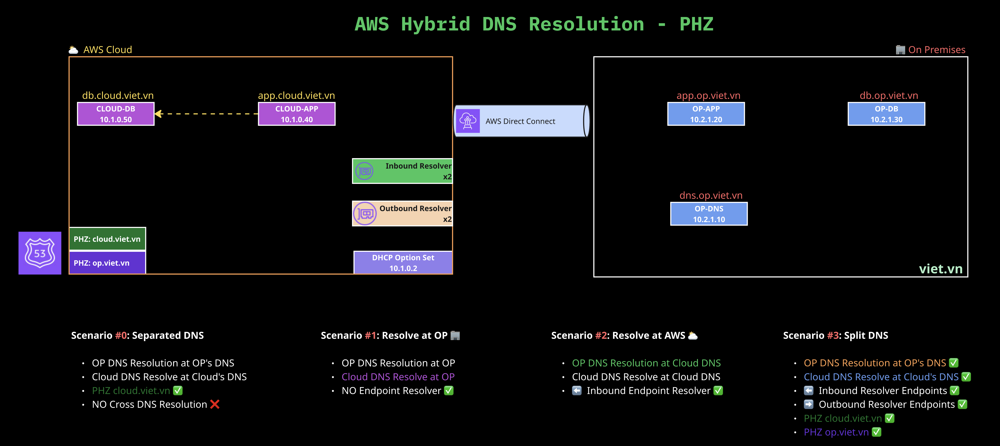

# Hybrid DNS Demo — Amazon Route 53 & On-Premises

A hands-on demo covering hybrid DNS resolution between AWS (Amazon Route 53) and an on-premises environment simulated via VPC Peering.

> `cloud.viet.vn` is treated as a **private** hosted zone throughout this demo — it resolves only inside the Cloud VPC. `op.viet.vn` is repsentated for On-Premises resources (App & DB)

---

## Architecture



### Infra Detail

| Resource | Details |
|---|---|
| VPC A | `10.1.0.0/16`, DNS hostnames + support enabled |
| Subnet A (AZ-a) | `10.1.1.0/24` |
| Subnet A2 (AZ-b) | `10.1.2.0/24` — needed for Resolver HA |
| VPC OP | `10.2.0.0/16` |
| Subnet OP | `10.2.1.0/24` |
| VPC Peering | VPC A ↔ VPC OP, routes added both sides |
| Cloud-App | VPC A, `10.1.0.40`|
| Cloud-DB| VPC A, `10.1.0.50` |
| DNS Server (BIND) | VPC OP, `10.2.1.10`, BIND installed and running |
| OP-App Server | VPC OP, `10.2.1.20` |
| OP-DB Server | VPC OP, `10.2.1.30` |
| Inbound Resolver Ep | VPC A, `10.1.1.10` and `10.1.2.10` |
| Outbound Resolver Ep | VPC A, `10.1.1.11` and `10.1.2.11` |

---

## Three Scenarios

The same base infrastructure supports three DNS architectures, demonstrated in sequence:

### Scenario 0 — Separated DNS
BIND is authoritative for `op.viet.vn` and `cloud.viet.vn` PHZ is authoriztative for Cloud Infrastructure. Setup the demo foundation.

- **Cost:** ~$0.5/month Route 53 (no resolver endpoints)

### Scenario 1 — All DNS on On-Premises
BIND is authoritative for both `op.viet.vn` and `cloud.viet.vn`. VPC A uses custom DHCP options to point at BIND. AWS service queries (S3, EC2 APIs) are conditionally forwarded back to `10.1.0.2`.

- **Cost:** ~$0/month Route 53 (no resolver endpoints)
- **Best for:** Early cloud adoption, on-prem team retains full control

### Scenario 2 — All DNS on AWS
Route 53 hosts two PHZs: `cloud.viet.vn` and `op.viet.vn`. BIND becomes a pure forwarder to the Inbound Resolver Endpoint. Resolver Query Logging provides full visibility in CloudWatch.

- **Cost:** ~$184/month Route 53 (inbound endpoint only)
- **Best for:** Cloud-first organisations, centralised DNS visibility

### Scenario 3 — Split DNS
Route 53 owns `cloud.viet.vn`. BIND owns `op.viet.vn`. Cross-domain queries are routed via Resolver Endpoints. Each environment resolves its own domain locally with no round-trip.

- **Cost:** ~$438/month Route 53 (inbound + outbound endpoints + rule)
- **Best for:** Long-term hybrid, best performance, smallest blast radius


---

## Quick Start

### 1. Deploy base infrastructure

Launch each EC2 instance manually in the AWS Console:

| Instance | IP |
|----------|----|
| DNS Server | `10.2.1.10` (VPC OP) |
| App Server | `10.2.1.20` (VPC OP) |
| DB Server | `10.2.1.30` (VPC OP) | 
| Cloud-App | `10.1.0.40` (VPC A) | 
| Cloud-DB | `10.1.0.50` (VPC A) |


> User-data scripts run in the background on each EC2 after boot. Allow 3–5 min for BIND, PostgreSQL, and the HTTP servers to be ready.


### 2. Tear down

Delete all resources in reverse order via the AWS Console or CLI:
1. Route 53 Resolver Endpoints, Rules, PHZs, DNS Firewall rule groups, CloudWatch log groups
2. EC2 instances
3. S3 bucket
4. VPC Peering connection
5. Subnets, security groups, VPCs

---

## Demo Testing Commands

Each EC2 has a `dns-test` helper pre-installed. Connect via SSM or SSH, then:

```bash
# On any EC2 — quick DNS resolution check
dns-test

# On EC2-Cloud only — test MySQL across the hybrid boundary
db-test
```

Manual `dig` tests:

```bash
# Cloud domain
dig app.cloud.viet.vn

# On-prem domains
dig app.op.viet.vn
dig db.op.viet.vn

dig -x 10.2.1.30

# Check DNS
dig app.op.viet.vn NS

# AWS service (should always resolve)
dig s3.ap-southeast-1.amazonaws.com

# Verify which DNS server answered
dig app.op.viet.vn +noall +answer +comments | grep SERVER
```

---

## Cost Summary

| Scenario | Route 53 / month | Notes |
|----------|:----------------:|-------|
| All On-Prem (Scenario 1) | $0 | No resolver endpoints |
| All AWS (Scenario 2) | ~$184 | Inbound endpoint (2 IPs HA) |
| Split DNS (Scenario 3) | ~$438 | Inbound + Outbound endpoints + 1 rule |

The dominant cost in all cases is the Resolver Endpoint: **$0.125/hour per IP address**. For a demo/dev environment, reduce to 1 IP per endpoint (single AZ) to cut costs in half.

---

## Key Concepts Recap

**Inbound Resolver Endpoint** — a pair of IP addresses in your VPC that on-premises DNS servers can forward queries to. Queries arrive at these IPs and are answered by Route 53 Private Hosted Zones.

**Outbound Resolver Endpoint** — a pair of IP addresses in your VPC that Route 53 uses as a source to send forwarded queries outbound. Used together with Resolver Rules.

**Resolver Rule** — tells Route 53: "for domain X, send queries via the Outbound Endpoint to this target IP." Without a rule, Route 53 only resolves domains in its own hosted zones.

**Private Hosted Zone** — a Route 53 hosted zone that resolves only from within associated VPCs. The domain name does not need to be publicly registered.

**Split DNS** — a pattern where the same parent namespace (e.g. `op.viet.vn`) is split between two authorities: Route 53 owns `cloud.viet.vn`, BIND owns `op.viet.vn`. Each side resolves its own sub-domain locally and forwards the other direction via Resolver Endpoints.
