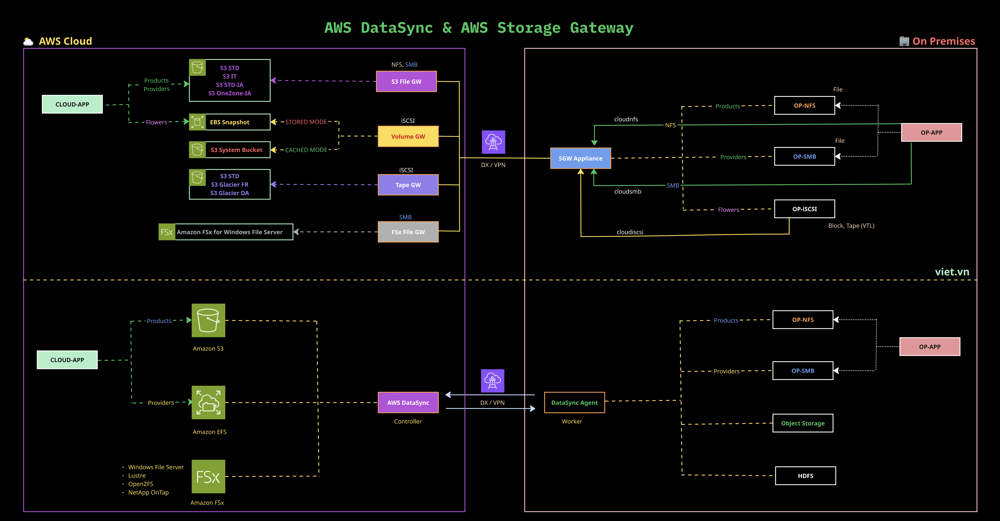

# AWS Storage Gateway vs AWS DataSync Hands-on AWS Architecting Pro

**📚 Course**: AWS Architecting Pro

**✅ Buy with Voucher**: https://viet.vn/udemy/architecting-pro 

**💻 Builder**: Viet Tran

**⛅️ Email**: hello@viet.vn

---

## 1. Overview & Purpose

This demo compares two AWS hybrid storage services that are frequently confused by customers and highly rated for AWS Certified Solution Architect Professional:

| | AWS Storage Gateway | AWS DataSync |
|---|---|---|
| **Primary use case** | Ongoing, low-latency hybrid access to cloud storage from on-premises applications | Scheduled or one-time bulk data transfer/migration between storage systems |
| **Access model** | Persistent mount point — applications see a local file system or block device | Task-based pipeline — define source, destination, and schedule |
| **Protocol support** | NFS, SMB (File GW), iSCSI (Volume GW), VTL (Tape GW) | NFS, SMB, Amazon S3 API, EFS, FSx, HDFS, object storage |
| **Latency** | Low (local cache on gateway appliance) | Optimized for throughput, not real-time access |
| **Best for** | Lift-and-shift, tiering, backup with local access | Migration, replication, archival pipelines |

The demo runs both services in a **single shared environment** so the leaners can directly compare behavior, configuration complexity, and use-case fit.

---

## 2. Architecture

---

## 3. Quick Reference: Protocol Support Matrix

| Protocol | Storage Gateway | DataSync |
|----------|----------------|----------|
| NFS v3/v4 | ✅ File Gateway (mount point) | ✅ Source + Destination |
| SMB v2/v3 | ✅ File Gateway (mount point) | ✅ Source + Destination |
| iSCSI | ✅ Volume Gateway + Tape Gateway | ❌ Not supported |
| Amazon S3 API | ❌ | ✅ Source + Destination |
| Amazon EFS | ❌ | ✅ Source + Destination |
| Amazon FSx | ✅ File Gateway (FSx target) | ✅ Source + Destination |
| HDFS | ❌ | ✅ Source only |
| Object Storage (S3-compatible) | ❌ | ✅ Source only |
| VTL (iSCSI tape) | ✅ Tape Gateway | ❌ |

**Key insight:** Storage Gateway provides a **persistent mount point** — applications talk to it like a local file system or block device. DataSync is a **task runner** — you explicitly trigger transfers. Same data, different operational model.

---

## 4. Key Differentiators

### DataSync — "Intelligent Data Mover"
- Explicitly **task-based**: you define what to move, where, and when
- Transfers are **optimized**: parallel multi-part, compression, integrity checksums end-to-end
- No persistent mount — once the task runs, the connection is not maintained
- Ideal for: migration to cloud, cross-service replication, archival pipelines

### Storage Gateway — "Hybrid Storage Extension"
- Applications on-prem **never change** — they still read/write to a local NFS/SMB mount or iSCSI disk
- Data is **transparently tiered** to S3/FSx/EBS in the cloud
- **Local cache** on the appliance provides low-latency reads for hot data
- Ideal for: lift-and-shift, backup with local access, cloud tiering without app changes

### Side-by-Side Comparison Point
> **Same NFS server, same data** — in the Storage Gateway demo, the NFS server mounts the gateway share and writes a file; the file silently lands in S3. In the DataSync demo, a task is explicitly triggered to move files from the same NFS server to S3.

---